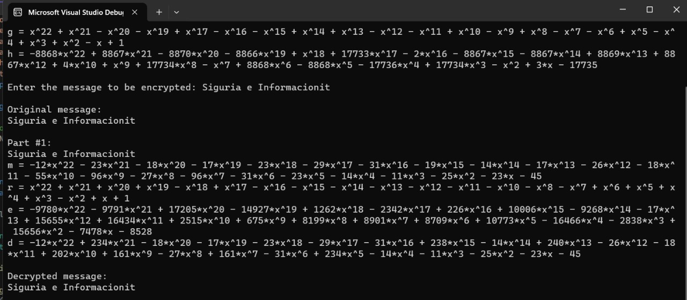
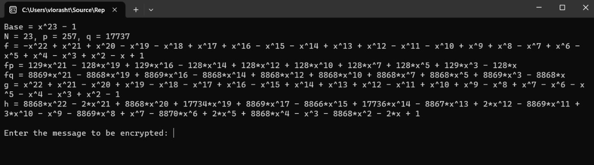
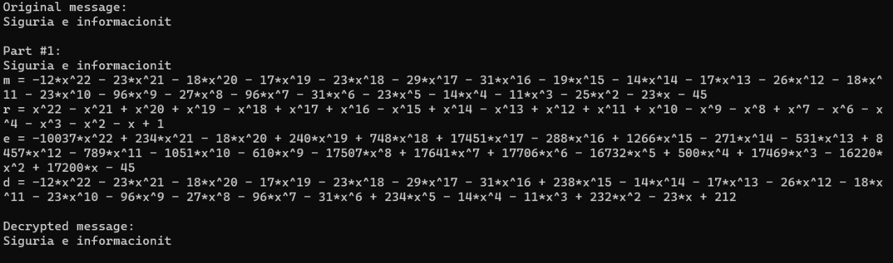

# NTRUEncrypt
Ky projekt në lendën: *Siguria e informacionit* përmban një implementim të algoritmit të enkriptimit NTRUEncrypt.  Ky algoritëm përdor një metodë të veçantë, e cila bazohet në përdorimin e formulave matematikore të quajtura "polinome" dhe një lloj llogaritjeje të quajtur "aritmetikë modulare", për të koduar (enkriptuar) dhe zgjidhur kodin (dekriptuar) të mesazheve. Në esencë, ai shndërron tekstet e zakonshme në një seri numrash dhe formash matematikore të komplikuara për të fshehur informacionin. Kur dëshiron të zbulosh sërish mesazhin origjinal, ai përdor një proces të kundërt për të kthyer këto numra dhe forma matematikore në tekst të lexueshëm. Programi është shkruar në C++ dhe është i projektuar për të siguruar një mënyrë të sigurt për komunikim të enkriptuar.

## Startimi i projektit

Ky seksion ju udhëzon hap pas hapi se si të filloni me projektin.

1. **Instalimi i Visual Studio:**
   - Shkarkoni dhe instaloni Visual Studio nga [Visual Studio Downloads](https://visualstudio.microsoft.com/downloads/). Sigurohuni që të zgjidhni përbërësit e nevojshëm për zhvillimin në C++, siç është kompiluesi C++ dhe debugger.

2. **Klonimi i projektit:**
   - Klononi repositorin e projektit nga GitHub duke përdorur këtë URL: [Information Security](https://github.com/VloraGjoka/Information_Security). Këtë mund ta bëni duke e hapur në një shfletues dhe duke zgjedhur "Clone or download" ose duke përdorur një klient Git.

3. **Hapja dhe ekzekutimi i projektit në Visual Studio:**
   - Hapni Visual Studio dhe zgjidhni "Open a project or solution". Navigoni tek direktoria ku keni ruajtur projektin e klonuar dhe hapeni atë.
   - Pasi projekti është i hapur, zgjidhni "Build" për të kompiluar projektin dhe pastaj "Run" për ta ekzekutuar.

## Si funksionon Algoritmi

Algoritmi ndërton bazën e enkriptimit duke përdorur polinome dhe numra të caktuar si konstante. Përmes një procesi të gjenerimit të çelësave, ai prodhon një seri polinomesh që përdoren për enkriptimin dhe dekriptimin e mesazheve. Mesazhet konvertohen në polinome përpara se të enkriptohen, dhe pastaj dekriptohen përsëri në tekst.

## Kërkesat e sistemit

- C++ Compiler (si p.sh. GCC, Clang, Visual Studio)
- IDE ose Redaktor Teksti (si p.sh. Visual Studio, Code::Blocks, CLion)
- Njohuri bazike në C++ dhe algoritme

## Udhëzime për përdorim

1. *Kompilimi dhe Ekzekutimi:* Hapni skedarin e kodit në IDE tuaj të preferuar për C++ dhe kompilojeni. Pastaj ekzekutoni programin.

2. *Futja e Mesazhit:* Kur programi kërkon, futni mesazhin që dëshironi të enkriptoni.

3. *Shikimi i Rezultateve:* Pas enkriptimit, programi do të shfaqë versionin e enkriptuar të mesazhit si dhe versionin e dekriptuar për verifikim.

## Shembull i ekzekutimit

1. *Kompilimi dhe Ekzekutimi:* 

 
2. *Futja e mesazhit:* Kur programi ekzekutohet, shkruani mesazhin që dëshironi të enkriptoni. Shembull:

3. *Shikimi i rezultateve:* Pas enkriptimit, programi do të shfaqë versionin e enkriptuar të mesazhit si dhe versionin e dekriptuar për verifikim.

## Kontributi
Blerona Idrizi

Vlora Gjoka

